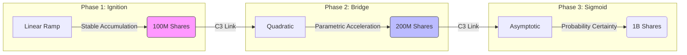

# Djinn: The Autonomous Prediction Protocol

**V4.0 "Aggressive" | Self-Custodial | On-Chain Solvent**

---

## 🧞‍♂️ Core Philosophy

Djinn is a **Pure AMM (Automated Market Maker)** for binary and multi-outcome events. It eliminates the need for order books or matching counterparties by using a mathematical **Bonding Curve** to guarantee immediate liquidity for any trade size.

Unlike traditional models, **Liquidity is the Market**. Every share purchased increases the price for the next buyer, creating a deterministic, tamper-proof price discovery mechanism.

---

## ⚡ The Lifecycle Flow

Djinn operates on a strict 4-step lifecycle, enforced by the Solana Smart Contract (`lib.rs`).

### 1. Creation (Genesis)
*   **User Action**: Cues a new market (e.g., "Will BTC hit $100k?").
*   **Protocol**: 
    1.  Initializes a **Market PDA** (Program Derived Address).
    2.  Sets the **Virtual Anchor** to 30M Shares (~30 SOL depth) to ensure price stability.
    3.  Transfers creation fee (0.01 SOL) to Treasury.
    4.  Status set to `Active`.

### 2. Trading (Active Phase)
*   **Buying**:
    *   User sends SOL -> Vault.
    *   Contract mints **Virtual Shares** based on the *Golden S Curve*.
    *   Price adjusts upward automatically.
    *   **Fee**: 1% (Split 50/50 between Creator & Treasury).
*   **Selling**:
    *   User burns Shares -> Contract.
    *   **Anti-Crash Protection**: Contract verifies the payout meets the user's `min_sol_out` (Slippage Check).
    *   Vault sends SOL -> User.
    *   Price adjusts downward.

### 3. Resolution (The Oracle)
*   A certified Oracle (or G1 Authority) performs the **Truth Verification**.
*   **Logic Check**: `timestamp >= resolution_time`.
*   **Snapshot**: The contract freezes the pot and records `total_pot_at_resolution`. This ensures mathematically fair payouts for everyone, regardless of claim order.
*   **Resolution Fee**: 2% deducted from the final pot.
*   Status set to `Resolved`.

### 4. Settlement (Claiming)
*   **Winners**: Call `claim_winnings`. 
    *   Formula: `(My Shares / Total Winning Shares) * Final Pot`.
    *   **Auto-Close**: The contract refunds the user's rent SOL (~0.002) alongside their winnings.
*   **Losers**: Their share value is effectively 0, as their capital was absorbed into the pot to pay the winners.

---

## 📐 The Math: "Golden S" Mutant Curve

Djinn uses a custom **3-Phase Piecewise Function** designed to reward early conviction while stabilizing late-stage speculation.

### The Virtual Anchor (Stability Engine)
We inject **30,000,000 Virtual Shares** into the equation at $t=0$. 
*   **Effect**: The market behaves as if it already has 30 SOL of liquidity.
*   **Benefit**: A 1 SOL buy moves the price by ~2% instead of 100%, preventing volatility shocks for early adopters.

### Phase 1: Ignition (Linear) `0 - 100M Shares`
*   **Goal**: Incentivize risk-takers.
*   **Math**: `P(x) = Base + m*x`
*   **Behavior**: Price rises steadily from **1,000 lamports** to **5,000 lamports**. Low cost, high potential multiplier.

### Phase 2: Bridge (Quadratic) `100M - 200M Shares`
*   **Goal**: Rapid price discovery.
*   **Math**: `P(x) \propto x^2`
*   **Behavior**: Price accelerates from 5k to 25k lamports. Buying pressure creates momentum.

### Phase 3: Sigmoid (Asymptotic) `200M+ Shares`
*   **Goal**: Final certainty.
*   **Math**: `P(x) \rightarrow 0.95 SOL`
*   **Behavior**: Price growth slows down as it approaches the logic cap (1 SOL = 100% Probability). At this stage, the market is pricing in "Certainty".

---

## 🏛️ Mathematical Architecture

The core innovation of Djinn is the use of **C3 Continuity** (Third-Order Smoothness) to link disparate pricing phases into a single, seamless bonding curve.

### Why C3 Continuity Matters?
Most bonding curves (like Bancor) are a single equation. Djinn is a **Mutant Curve** composed of three distinct equations.
*   **Tangent Continuity ($C^1$)**: Ensures no price jumps at transition points.
*   **Curvature Continuity ($C^2$)**: Ensures the *rate of price change* is smooth (no sudden acceleration shocks).
*   **C3 Continuity**: Ensures perfect smoothness for algorithmic trading bots.

---

## 🛡️ Security & Solvency Architecture

Djinn V4.0 implements military-grade constraints to protect user funds.

| Feature | Implementation | Purpose |
| :--- | :--- | :--- |
| **Anti-Spoofing** | `address = market.creator` | Prevents hackers from redirecting creator fees to their own wallets. |
| **Slippage Guard** | `require!(net >= min_sol_out)` | Auto-reverts a sell transaction if the price crashes while it is pending. |
| **Snapshot Pot** | `total_pot_at_resolution` | Locks the final vault value to guarantee every winner gets the exact same share price. |
| **Rent Refund** | `close = user` | Automatically reclaims unused storage data (SOL) for the user after claiming. |
| **Time Lock** | `clock < resolution_time` | Hard-stops all trading the second the event expires. |

---

### Contract Addresses
| Network | ID | Version |
| :--- | :--- | :--- |
| **Devnet** | `Fdbhx4cN5mPWzXneDm9XjaRgjYVjyXtpsJLGeQLPr7hg` | V4.0 (PDA/Aggressive) |

---

**Lord**

*Probability is the only truth.* 🧞‍♂️

