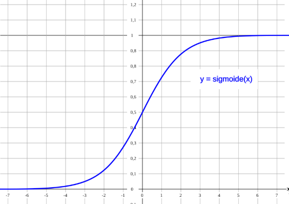

# DJINN: The Infinite Pool Prediction Engine

**DJINN** is a decentralized, non-custodial prediction protocol on Solana that reimagines global events as high-yield tradable assets. By utilizing an advanced **Asymptotic S-Curve Bonding Curve** architecture, DJINN merges the "Jackpot" psychology of prize pools with the mathematical precision of institutional-grade capital markets.



---

## 🛠️ Master Innovations

### 1. The "Golden Mutant" S-Curve (Proprietary Logic)
Unlike standard linear curves, DJINN utilizes a **Mutant Sigmoid Engine** for price discovery.

*   **Accumulation Phase (Early):** Near-flat pricing allows "Early Birds" to secure massive positions, achieving multipliers from **2,000x to 10,000x**.
*   **Mutation Phase (Parabolic):** The curve turns exponential as volume increases, driving FOMO and high-frequency trading.
*   **Certainty Phase (Asymptotic):** Price stabilizes as it approaches the outcome, ensuring all shares are backed by **Real SOL** in the Vault.

### 2. VIRTUAL_OFFSET: The "Heavyweight" Anchor (1B Adjustment)
To eliminate the "trash" volatility typical of memecoins, DJINN implements a **Virtual Anchor of 1,000,000,000 (1B) initial shares**.

*   **Market Density:** A $100 trade will not "break" the chart. The probability needle moves progressively and elegantly, allowing whales and institutions to trade without destructive price impact.
*   **Professional Stability:** The market feels "heavy" and solid, incentivizing strategic holding and scaled entries (tranching).

### 3. Elastic Supply & Infinite Liquidity
DJINN does not have a token cap; it possesses an **Algorithmic Lung**.

*   **Mint & Burn:** Every buy mints new shares backed 1:1 by SOL. Every sell burns the shares and releases the SOL from the Vault.
*   **Physical Vault:** 100% of invested capital resides in a **PDA (Program Derived Address)**. This ensures that even if a user hits a 5,000x, the protocol physically holds the liquidity to pay them out. In DJINN, a "Rug Pull" is mathematically impossible.

---

## ⚖️ Meritocracy & Stabilizing Arbitrage

DJINN is a **Pure Meritocracy**. The system rewards the intelligence of the predictor and the courage of the first mover.

*   **Automated Arbitrage:** If a whale manipulates the YES price, the NO side becomes mathematically "cheap." This attracts arbitrageurs who balance the market, extracting value from the manipulator and returning the needle to reality.
*   **Trading vs. Resolution:** Users can choose to sell their position at any time (**Trading Profit**) or hold until the final verdict to absorb the entire pool of the losers (**Resolution Jackpot**).

---

## 📊 Protocol Architecture v2.0

```mermaid
graph TD
    User((User))
    
    subgraph DJINN_MARKET_v2.0 ["DJINN MARKET v2.0 (Heavyweight 1B Offset & S-Mutant Curve)"]
        PreTrade[Start Trade]
        
        BuyOp[BUY (1% Fee)]
        SellOp[SELL (1% Fee)]
        ResolveOp[RESOLVE (2% Fee)]
        
        User --> PreTrade
        PreTrade --> BuyOp
        PreTrade --> SellOp
        PreTrade --> ResolveOp
        
        CurveEngine[S-Curve Golden Mutant (u128)<br/>P_new = sqrt(P_old² + 2 * NetIn * K)<br/>Virtual Anchor: 1,000,000,000 Shares]
        
        BuyOp --> CurveEngine
        SellOp --> CurveEngine
        ResolveOp --> CurveEngine
        
        GlobalVault[GLOBAL VAULT (Real Liquidity)<br/>PDA Program Account]
        
        CurveEngine --> GlobalVault
    end
    
    subgraph OUTCOMES
        Winners[WINNERS<br/>Payout Jackpot]
        Losers[LOSERS<br/>Burned to 0]
        Fees[G1 TREASURY<br/>Fees & Treasury]
    end
    
    GlobalVault --> Winners
    GlobalVault --> Losers
    GlobalVault --> Fees
    
    style DJINN_MARKET_v2.0 fill:#0E0E0E,stroke:#FF0096,stroke-width:2px,color:#fff
    style GlobalVault fill:#111,stroke:#00FFFF,stroke-width:2px,color:#fff
    style CurveEngine fill:#222,stroke:#FF0096,stroke-width:1px,color:#FF0096
    style Winners fill:#10B981,color:#000
    style Losers fill:#EF4444,color:#fff
    style Fees fill:#F59E0B,color:#000
```
*(Text Diagram for Compatibility)*
```
┌─────────────────────────────────────────────────────┐
│                  DJINN MARKET v2.0                  │
│       Heavyweight 1B Offset & S-Mutant Curve        │
└─────────────────────────────────────────────────────┘
                         │
        ┌────────────────┼────────────────┐
        │                │                │
   ┌────▼────┐      ┌────▼────┐     ┌────▼────┐
   │ BUY     │      │ SELL    │     │ RESOLVE │
   │ 1% Fee  │      │ 1% Fee  │     │ 2% Fee  │
   └────┬────┘      └────┬────┘     └────┬────┘
        │                │                │
        ▼                ▼                ▼
   ┌─────────────────────────────────────────┐
   │      S-Curve Golden Mutant (u128)       │
   │  P_new = sqrt(P_old² + 2 * NetIn * K)   │
   │  Virtual Anchor: 1,000,000,000 Shares   │
   └─────────────────────────────────────────┘
                         │
                         ▼
              ┌──────────────────┐
              │  GLOBAL VAULT    │
              │ (Real Liquidity) │
              └──────────────────┘
                         │
        ┌────────────────┼────────────────┐
        │                │                │
   ┌────▼────┐      ┌────▼────┐     ┌────▼────┐
   │ WINNERS │      │ LOSERS  │     │ G1 WALLET│
   │ Payout  │      │ Burned  │     │ Fees &   │
   │ Jackpot │      │ to 0    │     │ Treasury │
   └─────────┘      └─────────┘     └─────────┘
```

---

## 💰 Lord's Economy (G1 Treasury)

*   **1% Trading Fee:** Captured on every buy and sell on the curve, generating perpetual cash flow from volatility.
*   **2% Resolution Fee:** Value capture on the total pool volume upon market settlement.
*   **Creation Fee (~$5.00 Total):**
    *   **$3.00 (0.02 SOL):** Sent directly to the pool as **Genesis Seed** for instant trading.
    *   **$2.00 (0.013 SOL):** Sent directly to the G1 Treasury Wallet for the creator.

---

---

## 🏛️ The Multiplication Factor: Why the Starting Price is Your Best Ally

Many ask: **Why start at 0.00000267 SOL?** Is this price "too low"?
## 🦅 The Proportional Equity Manifesto (Architecture v2.0)

DJINN rejects the "Probability 0-1" model of traditional prediction markets. We do not trade probabilities; we trade **Risk Equity**.

### 1. The Golden Mutant Curve ($S^2/2K$)
Price is not determined by an order book. It is determined by the **Inverse Slope Integral** of the bonding curve.
- **Formula:** $Price = Shares / K$
- **Cost:** $\int (S/K) dS = S^2 / 2K$
- **Solvency:** The Vault ALWAYS holds the integral of the price curve. This guarantees that $Vault \ge \sum (UserShares \times SalePrice)$. Bank runs are mathematically impossible.

### 2. Proportional Equity (The Payout)
When a market resolves, the Global Vault (Winners + Losers + Dead Money) is distributed purely based on share ownership.
$$Payout = \frac{\text{UserShares}}{\text{TotalWinningShares (inc. Offset)}} \times \text{GlobalVault}$$
*Note: The `VIRTUAL_OFFSET` (1B Shares) acts as a permanent, non-claiming shareholder. This effectively "burns" a small portion of the vault to guarantee a price floor, rewarding early risk-takers who bought when the denominator was small.*

### 3. The Pioneer Advantage
- **Genesis Buyer:** Buys at $2.66 \times 10^{-6}$ SOL.
- **Late Buyer:** Buys at $0.15$ SOL.
The Pioneer gets **56,000x more equity** per SOL than the Late Buyer.
The system is designed to disproportionately reward those who provide the initial capital (Risk) over those who enter when the outcome is obvious (Safety).

### 4. Protocol Veritas
DJINN is the "Robinhood of Truth".
- Markets are backed by a **Source of Truth (URL)**.
- If the Source fails, the market is **Invalidated** and the Vault refunds the Equity holders.
- The House (G1 Treasury) takes a fee on the friction, but never steals the principal.

**"We don't sell odds. We sell Shares of the Future."**

### 📉 Scenario Table

| Scenario | Share Price | Investment | Shares Obtained | Potential Payout (ROI) |
| :--- | :--- | :--- | :--- | :--- |
| **Genesis (You)** | `0.000002 SOL` | 1 SOL | **865,000M** | **Epic (10,000x)** 🟢 |
| **Growth** | `0.023000 SOL` | 1 SOL | 43,000M | **High (100x)** 🟡 |
| **Maturity** | `0.160000 SOL` | 1 SOL | 6,000M | **Stable (2x - 5x)** 🔴 |

## 🚀 Elite Tech Stack

*   **Blockchain:** Solana (Mainnet-Beta) for instant settlement.
*   **Smart Contracts:** Anchor (Rust) with `u128` precision logic.
*   **Oracles:** Pyth Network / Custom Multi-Sig Lord Resolution.
*   **Frontend:** Next.js + Tailwind + Framer Motion (Pink Bubble Effects).

---

> **Code is Law. The Truth is Inevitable. Trade at your own risk.**
